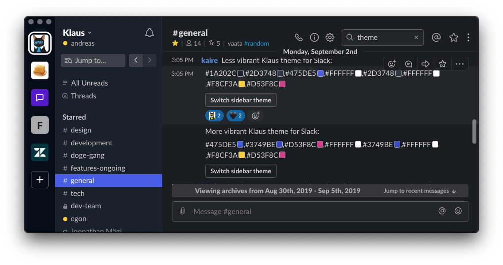
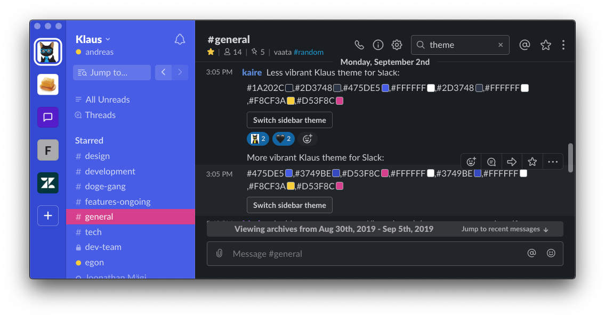

# 💅 Themes

Various themes with our brand colours

## 🦊 Firefox Color

https://color.firefox.com/?theme=XQAAAAIKAQAAAAAAAABBqYhm849SCia2CaaEGccwS-xNKlhVwOfv_ZWZhEM0Bb1c1mzpnCmakaJhKqqhH4bIHGZcBGEFHUa1lAX4hmo7odBkZ3K7h5AK1JsF3d0veIpQ_2XPjepvmpyudlx3mSp3gEhakgvwHdiE2hcEDSP90x6J7gX2xvaWousqqMLbIICGPrrc_F5PY8Z30byyqsXDmpVrc8xjjoqifcUihm_MB6LMo_QDvDHe2DJvFDa1GP0PrH4

## 💬 Slack themes

Navigate to `Settings > Themes` and paste a theme's HEX values at the very bottom, under the *Custom theme* section

### Dark

```
#1A202C,#2D3748,#475DE5,#FFFFFF,#2D3748,#FFFFFF,#F8CF3A,#D53F8C
```

Preview:



### Vibrant

```
#475DE5,#3749BE,#D53F8C,#FFFFFF,#3749BE,#FFFFFF,#F8CF3A,#D53F8C
```

Preview:


